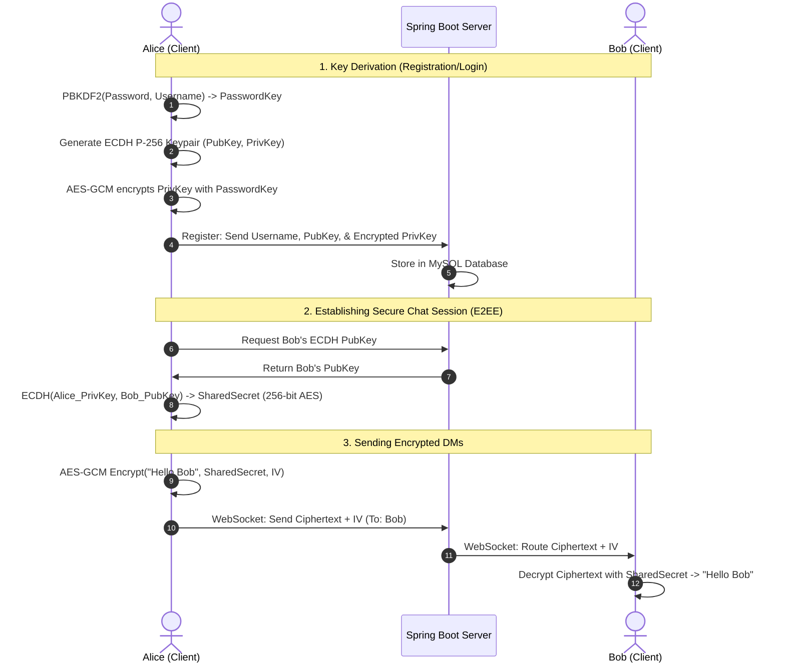

# 🔒 uChat: End-to-End Encrypted Chat Application with AI Summarization

[](https://www.oracle.com/java/)
[](https://spring.io/projects/spring-boot)
[](https://angular.dev/)
[](https://www.mysql.com/)
[](https://www.docker.com/)

**uChat** is a state-of-the-art, secure, full-stack real-time chat application. It is architected around a **Zero-Knowledge security model**, implementing End-to-End Encryption (E2EE) entirely client-side. The application also integrates Google's **Gemini 2.5 Flash API** to generate ultra-concise, on-demand AI summaries of message threads, demonstrating how high-level security features and modern AI capabilities can coexist seamlessly.

---

## 🚀 Key Features

* **Zero-Knowledge Private Messaging (E2EE):** Direct Messages (DMs) are encrypted client-side using AES-GCM-256 before being transmitted. The server never sees messages or file attachments in plaintext.
* **Deterministic Cryptographic Key Derivation:** Client keys are derived deterministically using **PBKDF2 with 100,000 iterations** from user credentials, allowing secure cross-device session restoration.
* **Asymmetric Key Exchange:** Utilizes **ECDH (Elliptic Curve Diffie-Hellman) P-256** to derive shared symmetric keys between chat participants without exposing private materials to the server.
* **AI-Powered Thread Summarization:** Leverages the **Gemini 2.5 Flash API** to summarize long text threads dynamically. Features a robust local fallback mechanism to maintain service availability if the API is unreachable.
* **Secure File Sharing:** Files are encrypted locally with a one-time random AES key before being uploaded. The file metadata and key are encrypted using the derived shared secret and transmitted via WebSockets.
* **Real-time Messaging Architecture:** Implemented via **Spring WebSocket (STOMP)** for instant duplex communication.
* **Modern Glassmorphic UI:** A dark-mode user interface designed using vanilla CSS, Outfit typography, responsive panels, and smooth micro-animations.

---

## 🛠️ Conceptual Architecture & Security Model

uChat implements a robust security lifecycle to enforce client-side confidentiality.



### 1. Key Derivation (PBKDF2)
To allow users to log in from different devices without storing their decryption keys in plaintext, uChat uses a deterministic key derivation function:
* **Algorithm:** PBKDF2 (Password-Based Key Derivation Function 2)
* **Parameters:** HMAC-SHA-256, 100,000 iterations
* **Salt:** Deterministically generated as `username.toLowerCase() + '_uchat_salt_v1'`
* **Purpose:** Derives a `PasswordKey` that is never shared with the backend. This key is used to encrypt the user's ECDH private key before saving it to the server database.

### 2. Elliptic Curve Diffie-Hellman (ECDH P-256)
Asymmetric cryptography is used to establish shared symmetric keys:
* Upon registration, each client generates an ECDH P-256 key pair.
* The public key is stored in plaintext on the database so friends can fetch it.
* The private key is encrypted locally (using the derived `PasswordKey`) and stored on the database.
* When Alice initiates a chat with Bob, her browser downloads Bob's public key, decrypts her own private key, and performs an ECDH key exchange locally to derive a **Shared Secret** (256-bit symmetric key).

### 3. Symmetric Encryption (AES-GCM-256)
* All private DMs are encrypted using **AES-GCM (Galois/Counter Mode)** with 256-bit keys.
* Every message package contains the encrypted ciphertext and a unique, cryptographically secure 12-byte Initialization Vector (IV).
* Since GCM provides authenticated encryption, it guarantees both message confidentiality and integrity.

### 4. Encrypted File Sharing
* When uploading a file, the client generates a random 256-bit AES key.
* The file bytes are encrypted locally with this key and uploaded via the REST API (`/api/chat/upload`). The server stores the encrypted payload inside the `uploads` directory.
* The decryption key and IV for the file are encrypted using the sender/receiver's **Shared Secret** and sent as a WebSocket payload (`fileId`, encrypted file key, and IV).
* The recipient downloads the encrypted file from `/api/chat/download/{fileId}` and decrypts it locally in the browser using the decrypted key.

---

## 🤖 AI Summarization (Gemini API)

The backend provides an AI integration endpoint (`/api/ai/summarize`) that interfaces with Google's **Gemini 2.5 Flash**:
1. **Dynamic Word Limits:** The backend calculates a target word limit based on the text length: `maxSummaryWords = Math.max(8, Math.min(25, wordCount / 5))`.
2. **Context-Optimized Prompting:** Prompts specify strict single-sentence limits, preventing conversational fluff and focusing strictly on the core message.
3. **Resilience & Fallbacks:** If the Gemini API key is missing or returns a non-200 status, the application falls back gracefully to a localized summary heuristic, ensuring no application downtime.

---

## 💻 Tech Stack & Dependencies

### Backend
* **Language:** Java 17
* **Framework:** Spring Boot 4.1.0 (with Web, WebSocket, Security, and Data JPA starters)
* **Database:** MySQL 8 (configured locally or via Google Cloud SQL MySQL socket factory)
* **Authentication:** JWT (JSON Web Tokens) via `java-jwt 4.4.0`
* **JSON Processing:** Jackson Databind

### Frontend
* **Framework:** Angular 19 (v19.2.0) Single Page Application
* **WebSocket Client:** `@stomp/stompjs`
* **Styling:** Vanilla CSS Custom Variables, glassmorphic styling, Outfit typography
* **Crypto Operations:** Web Crypto API (`window.crypto.subtle`)

---

## 📁 Repository Structure

```text
chatapp/
├── pom.xml                     # Backend project configuration & dependencies
├── Dockerfile                  # Multi-stage production build definition
├── src/                        # Spring Boot Backend
│   ├── main/
│   │   ├── java/com/chat/chatapp/
│   │   │   ├── controller/     # REST Endpoints & WebSocket controllers
│   │   │   ├── model/          # JPA entities (User, ChatMessage, FriendRequest)
│   │   │   ├── repository/     # Spring Data JPA repositories
│   │   │   └── security/       # JWT Filters, UserDetails & Security Configuration
│   │   └── resources/
│   │       ├── application.properties # Main backend configurations
│   │       └── static/         # Directory where built SPA assets are injected
│   └── test/                   # JUnit Backend Tests
└── frontend/                   # Angular Frontend
    ├── package.json            # Node dependencies & scripts
    ├── angular.json            # Angular CLI project configuration
    └── src/
        ├── app/
        │   ├── components/     # UI Components (login, register, chat)
        │   ├── services/       # Services (auth, chat, friend, crypto)
        │   └── app.routes.ts   # Client-side router configuration
        └── styles.css          # Global glassmorphism styles
```

---

## ⚙️ Setup and Installation

### Prerequisites
* **Java Development Kit (JDK) 17** or higher
* **Node.js 20** (with NPM)
* **MySQL Server 8.0**
* *Optional:* **Docker**

### 1. Database Setup
Create a MySQL database named `chatapp`:
```sql
CREATE DATABASE chatapp;
```

### 2. Environment Variables
Ensure the following variables are exported or set in your environment:
| Variable | Description | Example |
| :--- | :--- | :--- |
| `DB_URL` | JDBC Connection URL | `jdbc:mysql://localhost:3306/chatapp` |
| `DB_USER` | Database User Name | `root` |
| `DB_PASSWORD` | Database Password | `your_password` |
| `JWT_SECRET` | Secret key for signing JWTs | `a_highly_secure_random_string` |
| `GEMINI_API_KEY` | Google Gemini API Key | `AIzaSy...` |
| `PORT` | Running Port (default: 8080) | `8080` |

### 3. Local Development Run

#### Run Backend:
From the root directory:
```bash
# Windows
mvnw.cmd spring-boot:run

# macOS / Linux
./mvnw spring-boot:run
```

#### Run Frontend:
Open a separate terminal window and navigate to the `frontend` folder:
```bash
cd frontend
npm install
npm run start
```
The client will start at `http://localhost:4200/`.

---

## 🐳 Docker Deployment

The application features a fully containerized **multi-stage build** which builds the frontend SPA, bundles it inside the Spring Boot jar, and executes it inside a secure, lightweight Alpine JRE:

```bash
# Build the Docker image
docker build -t chatapp:latest .

# Run the container
docker run -d \
  -p 8080:8080 \
  -e DB_URL=jdbc:mysql://host.docker.internal:3306/chatapp \
  -e DB_USER=root \
  -e DB_PASSWORD=your_password \
  -e JWT_SECRET=your_jwt_secret \
  -e GEMINI_API_KEY=your_gemini_key \
  --name chatapp-instance \
  chatapp:latest
```
Once run, the application serves both the API endpoints and the static SPA assets on port `8080` (accessible at `http://localhost:8080`).

---

## 👨‍💻 Skills Showcased

* **End-to-End Cryptography:** Implemented browser-native `SubtleCrypto` primitives, handling raw byte conversions, dynamic symmetric key derivation, asymmetrically negotiated sessions, and local payload sealing.
* **REST & WebSockets Integration:** Crafted a dual communication layer leveraging both HTTP REST APIs (for authentication, history retrieval, and file uploads) and WebSockets STOMP (for real-time signaling, message delivery, and peer connection).
* **Enterprise Security Standards:** Integrated Spring Security + JWT authentication middleware, ensuring complete resource locking, custom filter chains, CORS configurations, and token validation.
* **AI API Pipelines:** Connected external Large Language Model APIs asynchronously while handling request/response serialization, variable limits, and fault-tolerance patterns.
* **Full-Stack Orchestration & DevOps:** Structured a clean multi-stage Docker build pipeline reducing compilation overhead, and organized unified runtime deployments.
